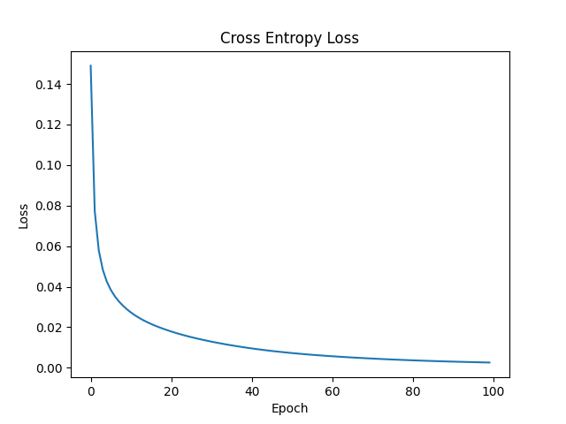

# Building Neural Networks

## From Scratch
Here I build neural networks to understand the basic statistical principles behind them.

  

## Simple Pytorch
I build simple networks using pytorch
  

## Time Dataset Classification  
I use this dataset from [Kaggle](https://www.kaggle.com/datasets/gpiosenka/time-image-datasetclassification) to create a classification model with more than 99.8% accuracy on the test set.  
  

  
## References
Neural Network from Scratch  
[towardsdatascience](https://towardsdatascience.com/math-neural-network-from-scratch-in-python-d6da9f29ce65)  
Math for Convolutional Neural Networks  
[medium](https://medium.com/@2017csm1006/forward-and-backpropagation-in-convolutional-neural-network-4dfa96d7b37e)  
Activation function math (Softmax and Softmax derivative):  
[medium](https://automata88.medium.com/how-to-implement-the-softmax-derivative-independently-from-any-loss-function-ae6d44363a9d)  
Cross Entropy and other activation functions:  
[vitalflux.com/cross-entropy-loss-explained-with-python-examples](https://vitalflux.com/cross-entropy-loss-explained-with-python-examples/)  
[medium](https://medium.com/swlh/cross-entropy-loss-in-pytorch-c010faf97bab)  
Pytorch 
[pytorch datacamp](https://www.datacamp.com/tutorial/pytorch-tutorial-building-a-simple-neural-network-from-scratch)  
Vanishing Gradient  
[towardsdatascience](https://towardsdatascience.com/the-vanishing-gradient-problem-69bf08b15484)  
Regularization  
[machinelearningmastery](https://machinelearningmastery.com/dropout-for-regularizing-deep-neural-networks/)  
Pooling  
[machinelearningmastery](https://machinelearningmastery.com/pooling-layers-for-convolutional-neural-networks/)

