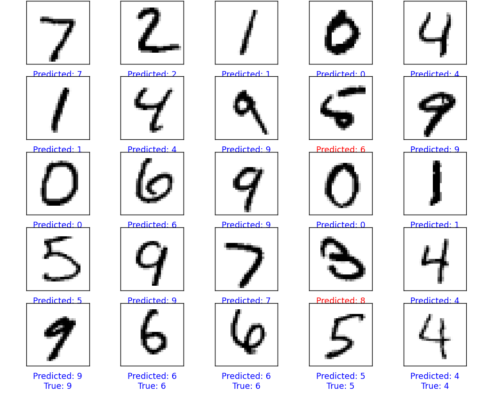

# Building Neural Networks

## From Scratch
Here I build neural networks to understand the basic statistical principles behind them.

  

## References
Neural Network from Scratch  
[Link](https://towardsdatascience.com/math-neural-network-from-scratch-in-python-d6da9f29ce65)  
Math for Convolutional Neural Networks  
[Link](https://medium.com/@2017csm1006/forward-and-backpropagation-in-convolutional-neural-network-4dfa96d7b37e)  
Activation function math (Softmax and Softmax derivative):  
[Link](https://automata88.medium.com/how-to-implement-the-softmax-derivative-independently-from-any-loss-function-ae6d44363a9d)  
Cross Entropy and other activation functions:  
[Link](https://vitalflux.com/cross-entropy-loss-explained-with-python-examples/
)  
[Link](https://medium.com/swlh/cross-entropy-loss-in-pytorch-c010faf97bab)  

